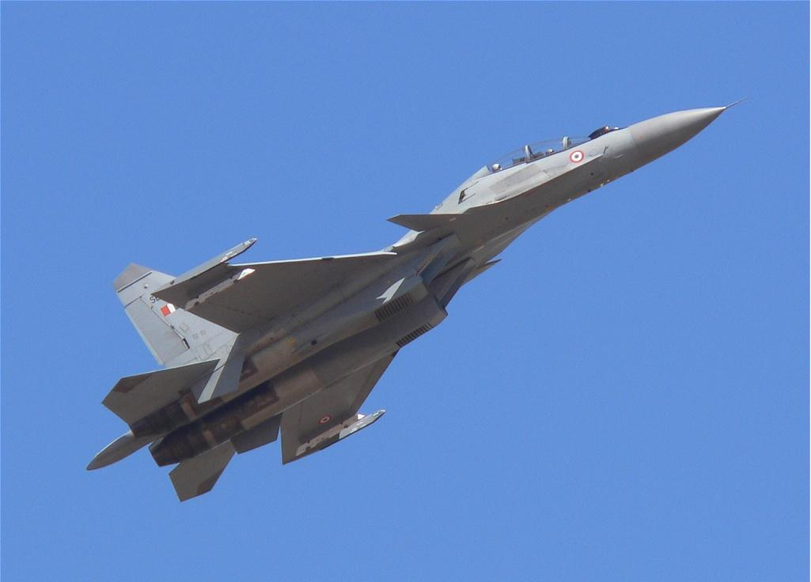

<html>
<title>The Indian Airforce</title>
<h1>IAF FIGHTERS</h1>

<ul>
  <li><a class="active" href="gallery.html">Gallery</a></li>
  <li><a href="#news">News</a></li>
  <li><a href="#contact">Contact</a></li>
  <li><a href="#about">About</a></li>
</ul>
<body>

The Sukhoi Su-30 MKI (NATO reporting name Flanker-H) is a variant of the Sukhoi Su-30, with French, Israeli and Indian subsystems, jointly-developed by Russia's Sukhoi Corporation and India's Hindustan Aeronautics Limited for the Indian Air Force.
The Indian Air Force fields one of the largest air superiority fleets in the world, with close to 300 Su-30MKI advanced heavy fighters by 2018 having been acquired from Russia giving it a distinct edge over neighbouring Pakistan’s unspecialised single engine light fighters and parity with China’s J-11B – the FLANKER mainstay of the People’s Liberation Army’s air fleet.

SU-30 aircraft is a twin engine, twin seater, multi-role fighter that can simultaneously be operated as an intercepter, bomber and trainer. It is capable of attaining a maximum speed of two Mach with a maximum climb rate of 270 metres per second. The Su-30MK is equipped by the latest radars designed by Indian specialists and with the Akash air-to-air missile. The Sukhoi-30 can be modified into a naval version, if the Indian Government chose to deploy it on an aircraft carrier.

Codenamed `Flanker' by NATO, the twin-seat SU-30, a derivative of the Su-27, is a multi-role fighter bomber and air superiority aircraft which can also be used in the maritime strike role. The Flanker has and operational radius of around 1500 km, and are equipped with an inflight refuelling facility extending their radius by another 500 km.

The higher cost of indigenously manufactured SU-30MKI is due to following factors:-

Additional modifications are incorporated in the indigenous Su-30MKI to enhance the operational capability and to suit Indian Air Force (IAF) requirements.
Being a Transfer of Technology (ToT) program, cost is involved towards payment of license fee to Russian side.
Owing to the low volume of production of Indian SU-30 MKI as compared to Russian SU-30, economies of scale come into play.
Import of raw materials and proprietary components from Russia involves dependency on Russian Original Equipment Manufacturers (OEMs) for the offered kit costs, which are not proportionate with the kit contents.
However, indigenous manufacturing has created advanced skill sets in the country, a step towards self-reliance and will result in lower Life Cycle Cost and reduced dependency on OEM on repair & maintenance and faster turn-around time and quick support to IAF bases. Since the facilities are indigenously established, future production supplies is likely to be cheaper if new order for bulk production is placed on HAL.

<picture>

</picture>
</body>
</html>
